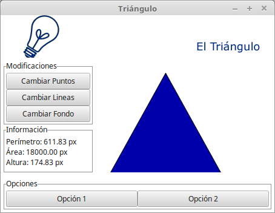

# Descripción

## Enunciado

Se quiere construir un programas que permita manejar un triángulo.
Esta figura geométrica está definida por tres puntos, cada uno de los cuales tiene
dos coordenadas X, Y.
Un triángulo tiene, además, un color para las lineas y un color de relleno.
Un color, por su parte, está definido por tres valores numéricos entre 0 y 255
(estándar RGB por Red-Green-Blue).
EL primer valor numérico define la intensidad en rojo, el segundo valor define
la intensidad en verde y el tercer valor define la intensidad en azul.

El programas debe (1) dibujar el triángulo en la pantalla, (2) calcular el
perímetro del triángulo, (3) calcular el área del triángulo, (4) calcular la altura
del triángulo.

## Interfaz

### Project with Tensorflow

This project uses Tensorflow to classify images in format webp that were scraped 
from of ECommerce. The scraper donwload the images of site, but these these images 
have meaningless numbers as file name, so the idea is to use Tensorflow to classify
and sort these images into directories for later use.

The process currently has three stages, the first is the scrapper, the seconds is the
classification of these images and the third stage is move these images to the
corresponding directory to give in the order imposed in the second stage.
